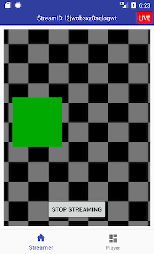
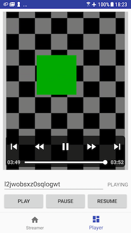
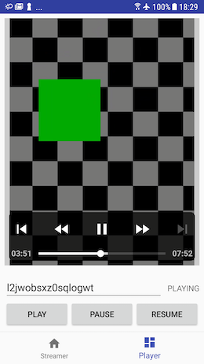

# Hello Firekast 🚀

This **Android app** features a streamer and a player and illustrates how to make live streaming in seconds with Firekast Android SDK.

1. Git clone this project.
2. Modify `App.kt` with your Firekast app's credentials. Visit our [dashboard](https://dashboard.firekast.io/) if you don't have yet and starts using Firekast **for free**.
3. Run the code on your favorite mobile device.

In the app, make a live stream in the 1st tab. When you are done, stop the live, go on the 2nd tab and watch your stream whether its live or VOD, the player will figure it out. You can also watch and manage the stream in the [dashboard](https://dashboard.firekast.io/).

Note, the player will automagically figures out whether the stream is live or VOD and will adapt its UI accordingly.

Happy live stream! 🎥

## Firekast SDK

### Documentation

Firekast SDK is 100% documented.

Developer documentation can be found at [docs.firekast.io](https://docs.firekast.io).

In addition, if needed, the full Android API reference can be found [here](https://firekast.io/sdk/android/docs/).

### Release notes

Firekast SDK release notes can be found [here](https://docs.firekast.io/?java#release-notes).
